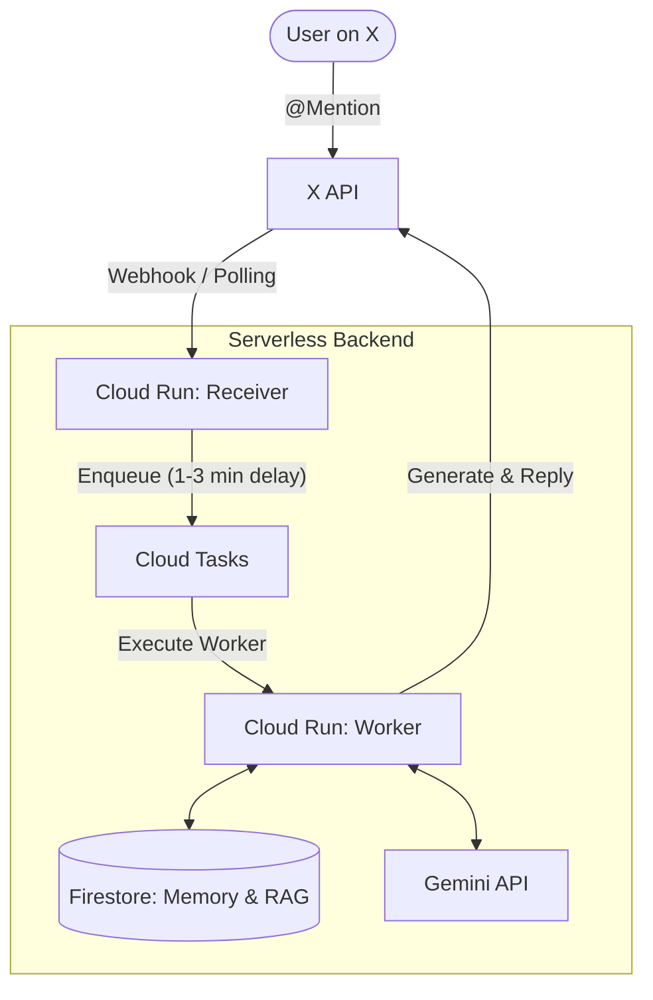

# Rebecca - The Unconditional Affirmation Gyaru AI 

[](https://github.com/akina-se/rebecca-ai/actions/workflows/ci.yml)
[](https://github.com/akina-se/rebecca-ai/actions/workflows/codeql.yml)
[](https://opensource.org/licenses/MIT)
[](https://github.com/akina-se/rebecca-ai/releases)


**The kindest, unconditional affirmation Gyaru AI.**
This is a fully serverless backend system operating on X (formerly Twitter), leveraging Google Cloud Platform (GCP) and the Gemini API.

[日本語版の仕様書 (Japanese Specification)](docs/specification_ja.md) | [English Specification](docs/specification_en.md)

⚠️ **IMPORTANT DISCLAIMER FOR OPERATORS** ⚠️
When operating this bot on X (Twitter), you MUST explicitly state in the account's profile description or pinned tweet: **"Rebecca is an AI, and her statements are fiction. She has no relation to real individuals or organizations."** This is critical to mitigate legal risks such as defamation, as the AI's generated "Gyaru" persona may inadvertently target real entities.

---

## Features

- **Triple-Buffer Memory System**: Converts conversation contexts into long-term memory (RAG) efficiently without losing detail.
- **Dynamic Context Injection**: Dynamically alters the AI's prompt based on the time of day (morning/late night), user absence duration, and specific keywords like "overtime" or "boss".
- **Automatic Language Separation**: Detects the user's input language and switches entirely to an English system prompt (featuring English slang) for English-speaking users, preventing unnatural code-switching.
- **Intentional Delay**: Introduces a random 1-3 minute delay before replying to simulate human behavior.
- **Strict Rate Limiting**: Multi-tiered dynamic limit management (Global Monthly, Global Daily, Dynamic User Allocation) to prevent unexpected API billing explosions for both X API and GCP.

## Tech Stack

- **Language**: TypeScript / Node.js (Express)
- **AI Models**:
  - Main Conversation: `gemini-3.1-flash-lite`
  - Language Detection & Safety Audit: `gemma-4-31b-it`
  - RAG Vectorization: `text-embedding-004`
- **Infrastructure (GCP)**: Cloud Run, Cloud Tasks, Cloud Scheduler, Cloud Firestore
- **SNS Integration**: X API v2 (`twitter-api-v2`)

## Architecture



## Setup Instructions

> **⚠️ Note on Gemini API (Free Tier):**
> If you are using the free tier of the Gemini API (via Google AI Studio), please be aware that your prompts and data may be used by Google to improve their products. Do not send highly confidential personal information unless you are using a paid tier or Vertex AI.


### 1. GCP Project Setup
1. Create a new project in the GCP Console and enable billing (required even for the free tier).
2. Enable the following APIs: `Cloud Run API`, `Cloud Tasks API`, `Cloud Firestore API`, `Cloud Scheduler API`
3. Create a Firestore database (Native mode recommended).
4. Create a Cloud Tasks queue:
   ```bash
   gcloud tasks queues create rebecca-reply-queue --location=asia-northeast1
   ```
5. Create a Firestore composite index (for RAG vector search):
   ```bash
   gcloud alpha firestore indexes composite create \
     --collection-group=rag_memories \
     --query-scope=COLLECTION \
     --field-config=field-path=embedding,vector-config='{"dimension":768,"flat": "{}"}' \
     --field-config=field-path=userId,order=ASCENDING \
     --project=your-gcp-project-id
   ```

### 2. Environment Variables
Create a `.env` file in the project root and configure the following variables:

```env
# Server
PORT=8080
POLLING_INTERVAL_MINUTES=0 # Polling interval in minutes when webhooks are unavailable

# GCP
GCP_PROJECT_ID=your-gcp-project-id
GCP_LOCATION=asia-northeast1
GCP_TASK_QUEUE_NAME=rebecca-reply-queue
WORKER_URL=https://your-cloud-run-service-url.a.run.app

# X API
X_API_KEY=
X_API_SECRET=
X_ACCESS_TOKEN=
X_ACCESS_SECRET=
X_BEARER_TOKEN=
X_MY_USER_ID=your-bot-twitter-user-id

# Gemini API Models
GEMINI_API_KEY=
GEMINI_MODEL=gemini-3.1-flash-lite
GEMINI_JUDGE_MODEL=gemma-4-31b-it
GEMINI_LANGUAGE_MODEL=gemma-4-31b-it
GEMINI_EMBEDDING_MODEL=text-embedding-004

# Rate Limits
GLOBAL_DAILY_LIMIT=45
GLOBAL_MINUTE_LIMIT=5
SPAM_MINUTE_LIMIT=3
```

### 3. Local Execution & Testing
```bash
# Install dependencies
npm install

# Run tests (with coverage)
npm run test:cov

# Run LLM-as-a-Judge Prompt Safety tests
npm run test:eval

# Test chatting locally via CLI
npm run chat

# Manually trigger Batches
npm run batch:evolution
npm run batch:news
```

### 4. Deployment
```bash
npm run deploy
```

## Community & Security

- **[Code of Conduct](CODE_OF_CONDUCT.md)**: We are committed to fostering a welcoming community. Please read and follow our Code of Conduct.
- **[Security Policy](SECURITY.md)**: If you discover a security vulnerability, please refer to our Security Policy for reporting instructions.
- **[Contributing Guide](CONTRIBUTING.md)**: Want to help? Check out our guidelines for submitting pull requests and issues.

## Directory Structure
- `src/index.ts` : Application entry point
- `src/core/` : Core domain logic (Memory management, Context injection, Evolution audit)
- `src/services/` : External service integrations (Firestore, Gemini, X, Cloud Tasks)
- `src/config/` : Configuration and environment variables
- `tests/` : Unit and integration tests
- `scripts/` : Deployment and utility scripts

---
## License
This project is licensed under the [MIT License](LICENSE).

## Author
AKINA