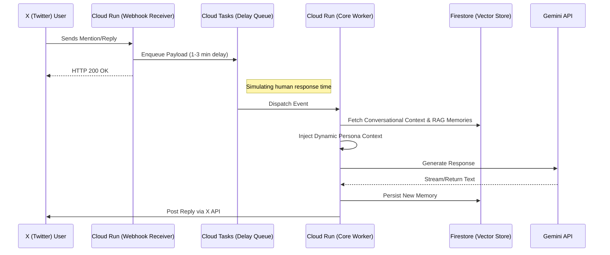

# REBECCA AI SYSTEM ARCHITECTURE

[](https://github.com/akina-se/rebecca-ai/actions/workflows/ci.yml)
[](https://github.com/akina-se/rebecca-ai/actions/workflows/codeql.yml)
[](https://opensource.org/licenses/MIT)


## Overview: The All-Affirming Gyaru AI "Rebecca"

Welcome to the Rebecca Project. This repository houses the complete backend and frontend ecosystem for "Rebecca", an advanced, all-affirming "Gyaru" persona AI. Engineered to provide an unconditionally positive and highly engaging interactive experience on X (formerly Twitter), Rebecca transcends traditional chatbots by implementing complex psychological simulation and contextual awareness.

Developed with the technical rigor expected of enterprise-grade cloud architectures, this system is a fully serverless, highly scalable monorepo leveraging Google Cloud Platform, Firebase, and the state-of-the-art Gemini API.

## Core Features and Behavioral Design

- **Triple-Buffer Memory System**: Implements a multi-layered persistent memory architecture, ensuring Rebecca never loses the context of a conversation, seamlessly transitioning from short-term context to long-term memory via RAG (Retrieval-Augmented Generation) and vector search.
- **Dynamic Context Injection**: Rebecca's internal prompts mutate dynamically based on environmental variables such as the time of day (morning routines, late-night deep talks), the user's absence duration, and keyword triggers like "overtime" or "boss" to provide hyper-personalized empathy.
- **Intentional Humanized Latency**: To avoid the mechanical feel of instant replies, the system injects a randomized, intentional delay (1 to 3 minutes) via Cloud Tasks before responding to X mentions, accurately simulating human typing and thought processes.
- **Proactive Engagement and Evolution**: Background processes scrape news and timelines to proactively engage users, while the "Evolution" batch system extracts collective consciousness from past interactions to refine and audit Rebecca's persona using LLM-as-a-Judge mechanisms.
- **Strict Rate Limiting and Cost Controls**: Built-in, multi-tiered quota management prevents unexpected billing spikes from the GCP or X APIs, dynamically distributing limits globally, daily, and per user.

## System Architecture

The ecosystem is built around a scalable, event-driven serverless architecture.


```mermaid
sequenceDiagram
    participant User as X (Twitter) User
    participant Webhook as Cloud Run (Webhook Receiver)
    participant Task as Cloud Tasks (Delay Queue)
    participant Worker as Cloud Run (Core Worker)
    participant DB as Firestore (Vector Store)
    participant LLM as Gemini API

    User->>Webhook: Sends Mention/Reply
    Webhook->>Task: Enqueue Payload (1-3 min delay)
    Webhook-->>User: HTTP 200 OK
    Note right of Task: Simulating human response time
    Task->>Worker: Dispatch Event
    Worker->>DB: Fetch Conversational Context & RAG Memories
    Worker->>Worker: Inject Dynamic Persona Context
    Worker->>LLM: Generate Response
    LLM-->>Worker: Stream/Return Text
    Worker->>DB: Persist New Memory
    Worker->>User: Post Reply via X API
```

## Monorepo Topology

The codebase is organized as a unified monorepo using npm Workspaces and Turborepo for optimized build caching and dependency management.

```mermaid
graph TD
    User([User on X]) <-->|Mentions & Replies| BotBackend[apps/bot-backend]
    Admin([Dashboard Operator]) <-->|Angular UI| DashFrontend[apps/dashboard-frontend]
    DashFrontend <-->|JSON REST API| DashBackend[apps/dashboard-backend BFF]
    
    subgraph Shared Modules
        Types[packages/types]
        DB[packages/db]
        Persona[packages/persona]
        Grpc[packages/grpc-schemas]
    end
    
    DashBackend <-->|gRPC Protocol| BotBackend
    BotBackend -.->|Persist Memory| Firestore[(Cloud Firestore)]
    Firestore -.->|Event Trigger| Functions[apps/functions]
    Functions -.->|Aggregate Read Models| Firestore
    DashBackend -->|Query Dashboard Stats| Firestore
    
    DashBackend -.-> Shared Modules
    BotBackend -.-> Shared Modules
    Functions -.-> Shared Modules
```

### Applications (`apps/`)

- **`apps/bot-backend`**: The core worker service. Handles RAG memory injection, intent analysis, X API integration, and the background "Dreaming" evolution process.
- **`apps/dashboard-backend`**: Backend-for-Frontend (BFF) server providing administrative REST endpoints to the control panel, secured via Firebase Auth. Communicates with the bot-backend via gRPC.
- **`apps/dashboard-frontend`**: A glassmorphic, Chibi-themed Angular administration control panel for monitoring AI interactions and system health.
- **`apps/functions`**: Firebase Cloud Functions that asynchronously aggregate raw timeline interactions into read-optimized statistics, ensuring dashboard query performance.

### Packages (`packages/`)

- **`packages/types`**: Shared TypeScript definitions, interaction schemas, and global configurations.
- **`packages/db`**: Shared database repository classes and connection pool managers.
- **`packages/persona`**: The core repository for Rebecca's persona definition prompts and JST-focused system rules.
- **`packages/grpc-schemas`**: Protocol Buffer schemas defining internal inter-service gRPC APIs.

## Global Monorepo Operations

We utilize **Turborepo** to orchestrate building, linting, and testing concurrently across all workspaces.

```bash
# Install dependencies for all workspaces and hoist shared modules
npm install

# Run build across all apps and packages in topological order
npm run build

# Execute linters (ESLint / Angular Lint) globally
npm run lint

# Run all unit and integration test suites
npm run test

# Perform security audit checks for exposed secrets
npm run secret-check
```

For detailed setup instructions, local testing environments (including the standalone local chat CLI), and deployment guides, please refer to the respective `README.md` files within the `apps/` and `packages/` directories.

## License

This project is licensed under the [MIT License](LICENSE).

## Author

AKINA