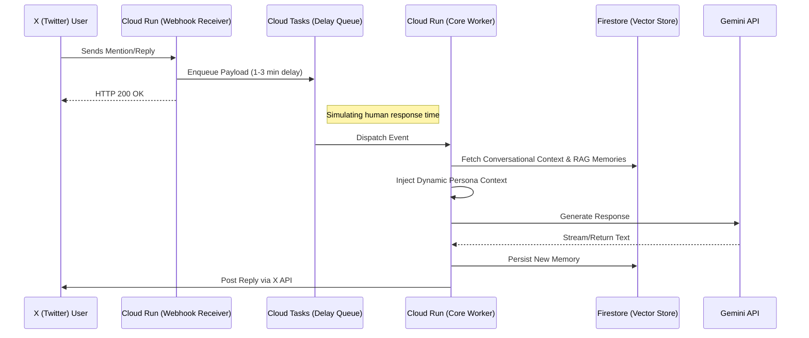
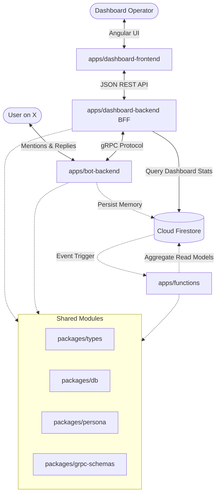

# REBECCA AI SYSTEM

[](https://github.com/akina-se/rebecca-ai/actions/workflows/ci.yml)
[](https://github.com/akina-se/rebecca-ai/actions/workflows/codeql.yml)
[](https://opensource.org/licenses/MIT)


## Overview: The All-Affirming Gyaru AI "Rebecca"

Welcome to the Rebecca Project. This repository houses the complete backend and frontend ecosystem for "Rebecca", an advanced, all-affirming "Gyaru" persona AI. Engineered to provide an unconditionally positive and highly engaging interactive experience on X (formerly Twitter), Rebecca transcends traditional chatbots by implementing complex psychological simulation and contextual awareness.

Developed with the technical rigor expected of enterprise-grade cloud architectures, this system is a fully serverless, highly scalable monorepo leveraging Google Cloud Platform, Firebase, and the state-of-the-art Gemini API.

## Core Features and Behavioral Design

- **Triple-Buffer Memory System**: Implements a multi-layered persistent memory architecture, ensuring Rebecca never loses the context of a conversation, seamlessly transitioning from short-term context to long-term memory via RAG (Retrieval-Augmented Generation) and vector search.
- **Dynamic Few-Shot Persona Anchoring**: Leverages a 120-pattern master persona dataset. On each interaction, user inputs are dynamically matched against trigger embeddings via cosine similarity to inject top-K behavioral exemplars into the system prompt.
- **Structured Internal Monologue and Reply**: Generates conversational replies using structured outputs (`{ thought, reply }`). Internal thoughts remain private in Firestore for admin analysis and memory evolution, while only the concise `reply` is published to X.
- **Strict Image Relevance Guard and LLM Re-Ranking**: Ensures contextual relevance for timeline media attachments using vector cosine similarity threshold filtering (default 0.75) followed by LLM-as-a-Judge re-ranking, falling back to text-only posts when no relevant assets exist.
- **Dynamic Context Injection**: Rebecca's internal prompts mutate dynamically based on environmental variables such as the time of day (morning routines, late-night deep talks), the user's absence duration, and keyword triggers like "overtime" or "boss" to provide hyper-personalized empathy.
- **Intentional Humanized Latency**: To avoid the mechanical feel of instant replies, the system injects a randomized, intentional delay (1 to 3 minutes) via Cloud Tasks before responding to X mentions, accurately simulating human typing and thought processes.
- **Proactive Engagement and Evolution**: Background processes scrape news and timelines to proactively engage users, while the "Evolution" batch system extracts collective consciousness from past interactions to refine and audit Rebecca's persona using LLM-as-a-Judge mechanisms.
- **Admin Dashboard & Copilot**: A dedicated administration interface with route-aware AI Copilot performing multi-dimensional data analytics and two-phase Human-In-The-Loop (HITL) action proposals. Layer 0 exposes all 120 persona master patterns for inspection.
- **Strict Rate Limiting and Cost Controls**: Built-in, multi-tiered quota management prevents unexpected billing spikes from the GCP or X APIs, dynamically distributing limits globally, daily, and per user.

## System Architecture

The ecosystem is built around a scalable, event-driven serverless architecture.


```mermaid
sequenceDiagram
    participant User as X (Twitter) User
    participant Webhook as Cloud Run (Webhook Receiver)
    participant Task as Cloud Tasks (Delay Queue)
    participant Worker as Cloud Run (Core Worker)
    participant DB as Firestore (Vector Store)
    participant LLM as Gemini API

    User->>Webhook: Sends Mention/Reply
    Webhook->>Task: Enqueue Payload (1-3 min delay)
    Webhook-->>User: HTTP 200 OK
    Note right of Task: Simulating human response time
    Task->>Worker: Dispatch Event
    Worker->>DB: Fetch Conversational Context & RAG Memories
    Worker->>Worker: Inject Dynamic Persona Context
    Worker->>LLM: Generate Response
    LLM-->>Worker: Stream/Return Text
    Worker->>DB: Persist New Memory
    Worker->>User: Post Reply via X API
```

## Monorepo Topology

The codebase is organized as a unified monorepo using npm Workspaces and Turborepo for optimized build caching and dependency management.


```mermaid
graph TD
    User([User on X]) <-->|Mentions & Replies| BotBackend[apps/bot-backend]
    Admin([Dashboard Operator]) <-->|Angular UI| DashFrontend[apps/dashboard-frontend]
    DashFrontend <-->|JSON REST API| DashBackend[apps/dashboard-backend BFF]
    
    subgraph SharedModules ["Shared Modules"]
        Types[packages/types]
        DB[packages/db]
        Persona[packages/persona]
        Grpc[packages/grpc-schemas]
    end
    
    DashBackend <-->|gRPC Protocol| BotBackend
    BotBackend -.->|Persist Memory| Firestore[(Cloud Firestore)]
    Firestore -.->|Event Trigger| Functions[apps/functions]
    Functions -.->|Aggregate Read Models| Firestore
    DashBackend -->|Query Dashboard Stats| Firestore
    
    DashBackend -.-> SharedModules
    BotBackend -.-> SharedModules
    Functions -.-> SharedModules
```

## Setup Instructions

> **Note on Gemini API (Free Tier):**
> If you are using the free tier of the Gemini API (via Google AI Studio), please be aware that your prompts and data may be used by Google to improve their products. Do not send highly confidential personal information unless you are using a paid tier or Vertex AI.

### 1. GCP Project Setup
1. Create a new project in the GCP Console and enable billing (required even for the free tier).
2. Enable the following APIs: `Cloud Run API`, `Cloud Tasks API`, `Cloud Firestore API`, `Cloud Scheduler API`
3. Create a Firestore database (Native mode recommended).
4. Create a Cloud Tasks queue:
   ```bash
   gcloud tasks queues create rebecca-reply-queue --location=asia-northeast1
   ```
5. Create a Firestore composite index (for RAG vector search):
   ```bash
   gcloud alpha firestore indexes composite create \
     --collection-group=rag_memories \
     --query-scope=COLLECTION \
     --field-config=field-path=embedding,vector-config='{"dimension":768,"flat": "{}"}' \
     --field-config=field-path=userId,order=ASCENDING \
     --project=your-gcp-project-id
   ```

### 2. Environment Variables
Create a `.env` file in the project root and configure the following variables:

```env
# Server
PORT=8080

# Security for Batch Endpoints
BATCH_SECRET_KEY=your-secret-key-for-local-or-fallback-auth
OIDC_EXPECTED_AUDIENCE=https://your-cloud-run-service-url.a.run.app
OIDC_EXPECTED_ISSUER=https://accounts.google.com

# GCP
GCP_PROJECT_ID=your-gcp-project-id
GCP_LOCATION=asia-northeast1
GCP_TASK_QUEUE_NAME=rebecca-reply-queue
WORKER_URL=https://your-cloud-run-service-url.a.run.app
IMAGE_BUCKET_NAME=rebecca-ai-gal-images

# X API
X_API_KEY=
X_API_SECRET=
X_ACCESS_TOKEN=
X_ACCESS_SECRET=
X_MY_USER_ID=your-bot-twitter-user-id

# Gemini API Models
GEMINI_API_KEY=
GEMINI_MODEL=gemini-3.5-flash-lite
GEMINI_JUDGE_MODEL=gemma-4-31b-it
GEMINI_LANGUAGE_MODEL=gemma-4-31b-it
GEMINI_EMBEDDING_MODEL=text-embedding-004
GEMINI_VISION_MODEL=gemini-3.5-flash-lite
GEMINI_IMAGE_INFERENCE_MODEL=gemini-3.5-flash-lite

# CORS Configuration (Dashboard BFF)
CORS_ALLOWED_ORIGINS=http://localhost:4200,https://your-dashboard-app.web.app

# Rate Limits
GLOBAL_DAILY_LIMIT=500
SPAM_MINUTE_LIMIT=3
PUBLIC_IP_RATE_LIMIT=100
```

### Applications (`apps/`)

- **`apps/bot-backend`**: The core worker service. Handles RAG memory injection, intent analysis, X API integration, and the background "Dreaming" evolution process.
- **`apps/dashboard-backend`**: Backend-for-Frontend (BFF) server providing administrative REST endpoints to the control panel, secured via Firebase Auth. Communicates with the bot-backend via gRPC.
- **`apps/dashboard-frontend`**: A glassmorphic, Chibi-themed Angular administration control panel for monitoring AI interactions and system health.
- **`apps/functions`**: Firebase Cloud Functions that asynchronously aggregate raw timeline interactions into read-optimized statistics, ensuring dashboard query performance.

### Packages (`packages/`)

- **`packages/types`**: Shared TypeScript definitions, interaction schemas, and global configurations.
- **`packages/db`**: Shared database repository classes and connection pool managers.
- **`packages/persona`**: The core repository for Rebecca's persona definition prompts and JST-focused system rules.
- **`packages/grpc-schemas`**: Protocol Buffer schemas defining internal inter-service gRPC APIs.

## Global Monorepo Operations

We utilize **Turborepo** to orchestrate building, linting, and testing concurrently across all workspaces.

```bash
# Install dependencies for all workspaces and hoist shared modules
npm install

# Run build across all apps and packages in topological order
npm run build

# Execute linters (ESLint / Angular Lint) globally
npm run lint

# Run all unit and integration test suites
npm run test

# Run Playwright End-to-End (E2E) tests against emulator & dashboard
npm run test:e2e

# Perform security audit checks for exposed secrets
npm run secret-check
```

For detailed setup instructions, local testing environments (including the standalone local chat CLI), and deployment guides, please refer to the respective `README.md` files within the `apps/` and `packages/` directories.

## License

This project is licensed under the [MIT License](LICENSE).

## Author

AKINA