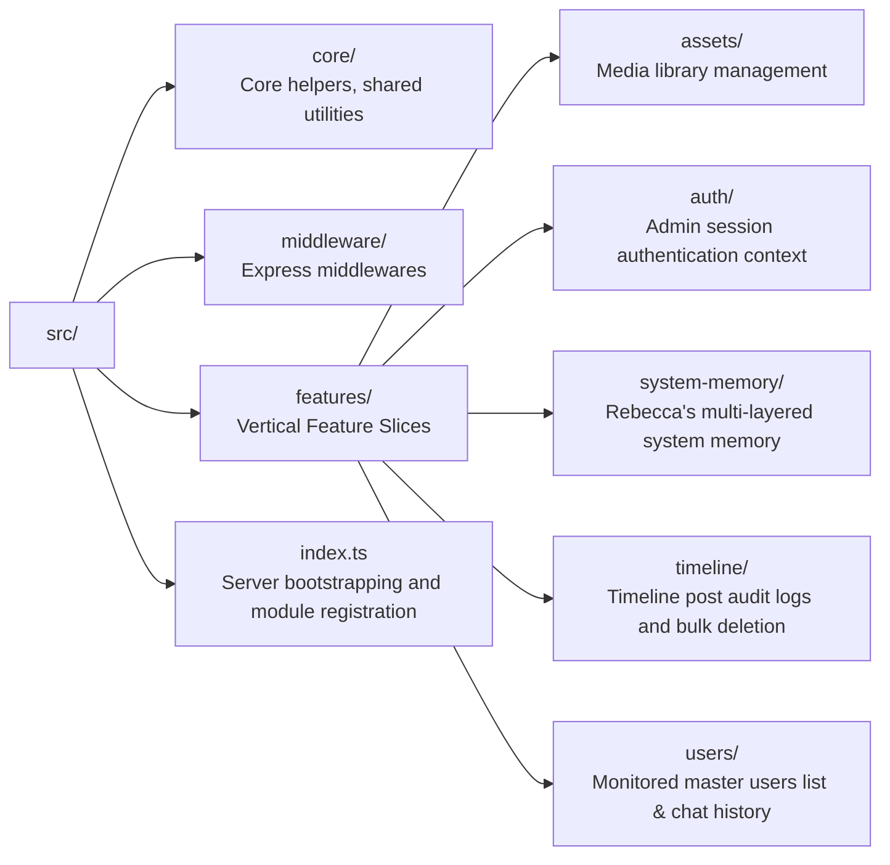

# Rebecca Admin Dashboard BFF (`dashboard-backend`)

The `dashboard-backend` is the Backend-for-Frontend (BFF) server for the Rebecca AI Admin Dashboard. It serves as an API Gateway, coordinates Firestore and Firebase Authentication operations, and handles inter-service communication with `bot-backend` using gRPC.

---

## 🏗️ Architectural Overview

This service is structured using **Feature-Driven (Vertical Slicing) Architecture** combined with Dependency Injection (DI). Rather than splitting code by technical layers (e.g., all controllers in one folder, all repositories in another), the codebase is organized around domain capabilities (Features):



Each feature slice contains:
- `index.ts`: Registers route definitions and wires up dependencies.
- `controller.ts`: Handles HTTP request decoding, param parsing, and response mapping.
- `usecase.ts`: Implements core business logic and orchestrates service flows.
- `repository.ts`: Interacts with Firestore database/external network APIs.

---

## ⚙️ Environment Variables

Copy or configure the following environment variables in `.env` or pass them in your shell:

| Variable | Description | Default |
|---|---|---|
| `PORT` | BFF listening port | `8081` |
| `NODE_ENV` | Environment mode (`development` / `production`) | `development` |
| `NO_AUTH` | When `true` in non-prod, bypasses Firebase JWT validation. | `false` |
| `GCP_PROJECT_ID` | Google Cloud / Firebase Project ID | `rebecca-ai-gal-local` |
| `FIRESTORE_EMULATOR_HOST` | Host + Port for Firestore Emulator | `127.0.0.1:8080` |
| `FIREBASE_AUTH_EMULATOR_HOST` | Host + Port for Firebase Auth Emulator | `127.0.0.1:9099` |
| `BOT_BACKEND_URL` | Endpoint of the bot execution engine | `http://localhost:50051` |

---

## 🚀 Getting Started

### 1. Install Dependencies
Run from the monorepo root:
```bash
npm install
```

### 2. Launch Firebase Emulators
Ensure the emulators are running locally (with Auth and Firestore active):
```bash
npx firebase emulators:start --project rebecca-ai-gal-local
```

### 3. Seed Mock Database
Populate the Firestore and Auth emulators with development records:
```bash
npm run seed --workspace=dashboard-backend
# Or directly: npx ts-node -T src/scripts/seed-db.ts
```

### 4. Run Development Server
Boot up the dev environment with hot reloading:
```bash
npm run dev --workspace=dashboard-backend
```

---

## 📖 API Contract (OpenAPI Spec)

Following Google senior engineering best practices, we use **OpenAPI 3.0** as the single source of truth for the API contract. This ensures documentation never drifts from code and permits automated client library generation or endpoint contract testing.

The complete specification is available in [openapi.yaml](./openapi.yaml).

### Summary of Endpoints

| Category | HTTP Method | Path | Description |
|---|---|---|---|
| **Alerts** | `GET` | `/api/v1/alerts` | Aggregates dynamic warning alerts across the system |
| **Users** | `GET` | `/api/v1/users` | List monitored users / leaderboard (paginated, sorted) |
| | `PUT` | `/api/v1/users/status` | Bulk update user statuses (Active, Blocked, Muted) |
| | `GET` | `/api/v1/users/{id}` | Get specific user details and paginated chat history |
| | `PUT` | `/api/v1/users/{id}/memory` | Update a user's memory profile (RAG attributes) |
| **Posts** | `GET` | `/api/v1/posts` | Paginated timeline posts with JST-aligned range filtering |
| | `DELETE` | `/api/v1/posts` | Bulk delete posts from Firestore & X (gRPC client) |
| **Images** | `GET` | `/api/v1/images` | Get paginated library image assets |
| | `POST` | `/api/v1/images/upload` | Upload image to GCS and generate captions via Gemini |
| | `PUT` | `/api/v1/images/{id}` | Update image name or caption metadata |
| **Memory** | `GET` | `/api/v1/memory/layers` | List system memory layers metadata (level 0, 1, 2) |
| | `GET` | `/api/v1/memory/core` | Get Layer 0 immutable Core Persona prompt |
| | `GET` | `/api/v1/memory/global` | Get Layer 2 dynamic Global summary prompt |
| | `PUT` | `/api/v1/memory/global` | Update Layer 2 dynamic Global summary content |
| | `POST` | `/api/v1/memory/force-dreaming` | Trigger asynchronous Dreaming consolidation |

---

## 🧪 Testing

Execute tests configured for the BFF:
```bash
npm run test --workspace=dashboard-backend
```
