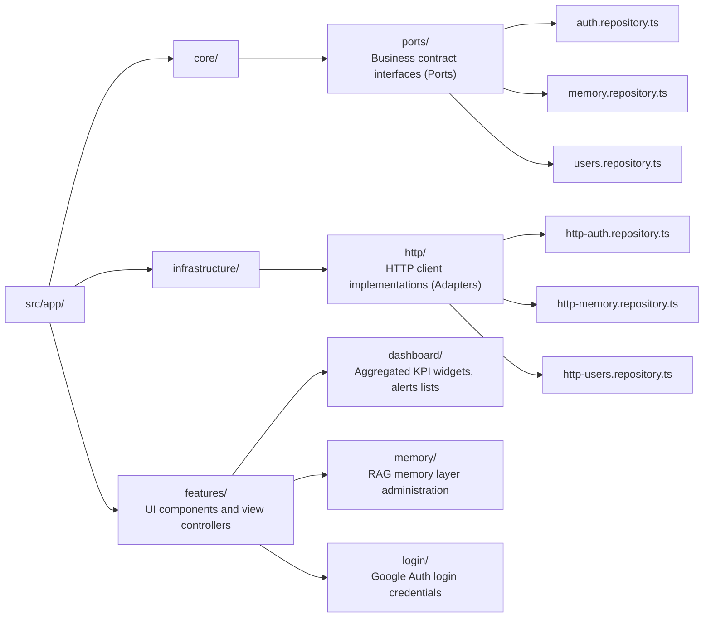

# Rebecca Admin Dashboard UI (`dashboard-frontend`)

An Angular-based, highly customized administration control panel for Rebecca AI, styled with a glassmorphic cyberpunk theme.

---

## 🎨 Design System & Aesthetics
- **Theme**: Chibi Cyberpunk / Glassmorphism.
- **Color Palette**: Neon purple primary (`--color-primary`), dark translucent glass panels (`glass-panel`), and bright status indicators.
- **Typography & Icons**: Inter / Outfit fonts and Google Material Icons.
- **UI Responsiveness**: Tailored layout budgets for desktop control panels and mobile-friendly overlays (e.g. paginated ranking modals, custom file drawers).

---

## 🏗️ Clean Architecture (Ports & Adapters)
To avoid hard-coupling the Angular application to a specific backend framework or HTTP library, the application is structured using the **Ports & Adapters (Hexagonal) Architecture**:



The app components inject core port tokens (e.g. `MEMORY_REPOSITORY`), which are resolved to their HTTP adapter classes in `app.config.ts`. This permits swap-out testing or local mock mocking without touching any view controllers.

---

## 🚀 Setup & Execution

### 1. Install Workspace Dependencies
Ensure packages are installed from the monorepo root:
```bash
npm install
```

### 2. Run Local Development Server
Boot up the Angular CLI development server:
```bash
npm run dev --workspace=dashboard-frontend
```
*Note: If port `4200` is already in use by another local process, Angular will prompt to serve on an alternative available port (e.g. `4201` or `59375`). Check the terminal outputs for the active server url.*

### 3. Production Build
Generates highly optimized static assets under the `/dist` directory:
```bash
npm run build --workspace=dashboard-frontend
```
This build enforces CSS size budgets (e.g., drawer components restricted under 2.05kB) to guarantee lightweight client delivery.
