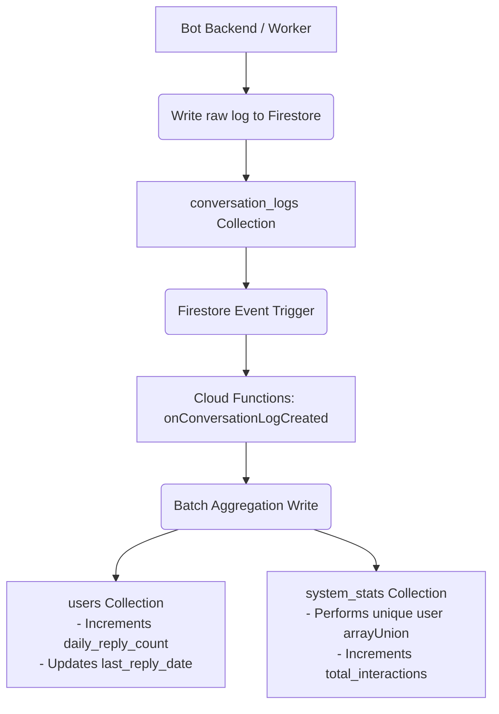

# Rebecca Cloud Functions (`functions`)

This workspace contains serverless **Firebase Cloud Functions (v2)** that handle event-driven background triggers within the Rebecca AI ecosystem.

---

## Architectural Pattern: CQRS Aggregator

To prevent Firestore read limit exhaustion and ensure fast dashboard queries, we separate write-heavy transactional data from read-heavy analytics models (**Command Query Responsibility Segregation / CQRS**).

Instead of the admin panel calculating metrics (such as Daily Active Users / DAU) on-the-fly by querying thousands of raw logs, background Cloud Functions automatically aggregate these logs into summary documents as they are created.



---

## Available Triggers

### 1. `onConversationLogCreated`
- **Trigger Source**: Firestore document creation on collection `conversation_logs/{logId}`.
- **Functionality**:
  - **User Metrics**: Increments the user's `daily_reply_count` counter and sets the `last_reply_date` timestamp.
  - **System Metrics**: Appends the active user's ID to `system_stats/dau_YYYY-MM-DD`'s `active_users` list (using Firestore `arrayUnion` to ensure uniqueness for DAU measurements) and increments `total_interactions`.

---

## Deployment & Development

### 1. Local Emulation
The Cloud Functions run locally inside the Firebase Emulator Suite.
To verify, ensure the emulator functions port is configured in `firebase.json` (defaults to `5001`).

### 2. Manual Testing
When seeding the database using the seed script, logs are added to Firestore, which automatically fires the local emulator function:
```bash
npm run seed --workspace=dashboard-backend
```

### 3. Production Deployment
To deploy functions to GCP:
```bash
firebase deploy --only functions
```
Ensure you have the Firebase CLI logged in and access to the target GCP project.
