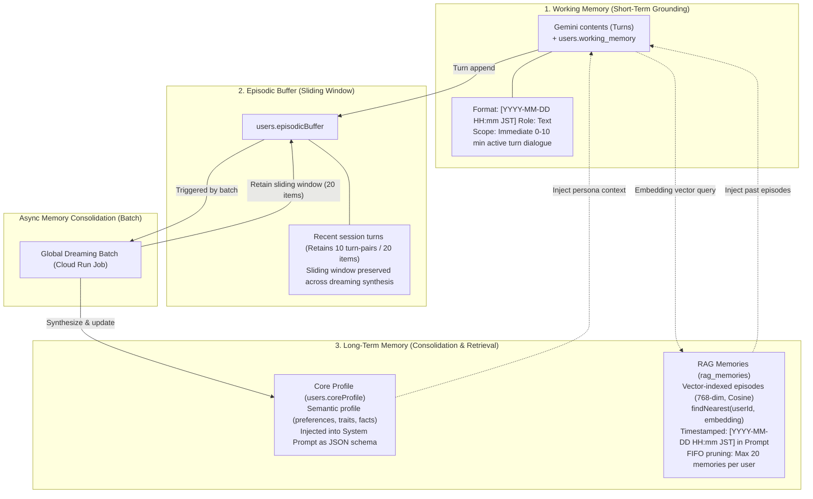

# Firestore Database Schema & 3-Tier Memory Architecture

## 1. Overview & Architectural Principles

This document defines the comprehensive database schema, indexing strategy, data lifecycle, and multi-tier memory architecture for **Rebecca AI**.

### Core Tenets
1. **Single Source of Truth (SSOT)**:
   - TypeScript interface definitions reside in `@rebecca/types` (`packages/types/src/index.ts`).
   - Collection names and `FirestoreDataConverter<T>` instances reside in `@rebecca/db` (`packages/db/src/index.ts`).
2. **Framework & Driver Agnostic Models**:
   - Application domain models never directly import `@google-cloud/firestore` or `firebase-admin/firestore`.
   - Date and time representations in domain models are strictly serialized as **ISO 8601 strings** (`YYYY-MM-DDTHH:mm:ss.sssZ`).
   - The `@rebecca/db` converter layer bridges disk representations (such as Firestore `Timestamp` or `VectorValue`) with memory models.
3. **Security by Default**:
   - `firestore.rules` enforces `allow read, write: if false;` for all direct client requests.
   - All database reads and writes are gated through authenticated microservices (Cloud Run, Cloud Functions) executing under least-privilege IAM service accounts.

---

## 2. 3-Tier Conversational Memory Architecture

Rebecca AI implements a hierarchical 3-tier memory model inspired by human cognitive memory systems, ensuring temporal consistency, continuity, and scalable storage:



### Entity Relationship Diagram (ERD)

```mermaid
erDiagram
    USERS ||--o{ CONVERSATION_LOGS : "generates (1:N)"
    USERS ||--o{ RAG_MEMORIES : "owns (1:N, max 20)"
    USERS ||--o{ RATE_LIMITS : "tracked by (1:N)"
    USERS ||--o| LIST_INTERACTION_HISTORY : "curated as (1:1)"
    USERS {
        string id PK "Normalized X Handle or User ID"
        string name "Display Name"
        string username "Handle without @"
        string avatarUrl "Avatar URL"
        string status "ACTIVE | BLOCKED | MUTED"
        json coreProfile "Consolidated Profile JSON"
        array working_memory "Ephemeral active turns"
        array episodicBuffer "Sliding buffer (20 entries)"
        string firstSeen "ISO 8601"
        string lastSeen "ISO 8601"
        string lastReplyDate "YYYY-MM-DD"
        int dailyReplyCount "Daily reply quota count"
        float affinityScore "Intimacy 0.0 - 1.0"
        int interactions "Lifetime interactions"
    }

    RAG_MEMORIES {
        string id PK "Auto-generated UID"
        string userId FK "Target user id"
        string text "Memory episode content"
        vector embedding "768-dim embedding (Cosine)"
        string timestamp "ISO 8601 datetime"
    }

    CONVERSATION_LOGS {
        string id PK "Auto-generated UID"
        string userId FK "Target user id"
        string userText "User input text"
        string aiText "Rebecca reply text"
        string thought "Persona internal monologue"
        string timestamp "ISO 8601 datetime"
        timestamp expireAt "TTL managed (5-year expiry)"
    }

    TIMELINE_HISTORY {
        string id PK "Auto-generated UID"
        string tweetId "X status ID"
        string text "Published post text"
        string thought "Persona monologue"
        string postType "soliloquy | news | anniversary"
        string status "SUCCESS | FAILED | PENDING"
        int impressions "Impression count"
        int likes "Likes count"
        int reposts "Retweets count"
        int replies "Replies count"
        array mediaUrls "Image URLs"
        string newsTitle "Optional news headline"
        string timestamp "ISO 8601 datetime"
        timestamp expireAt "TTL managed (5-year expiry)"
    }

    IMAGES {
        string id PK "SHA-256 Hash or Asset ID"
        string url "GCS URI gs://..."
        string filename "File name"
        string caption "Japanese semantic description"
        vector embedding "768-dim multimodal/text vector"
        timestamp lastUsedAt "Last timeline attachment"
        int useCount "Usage counter"
        string status "PENDING | PROCESSING | SUCCESS | FAILED"
    }

    PROCESSED_FOLLOWERS {
        string id PK "Follower X user ID"
        string userId "Follower X user ID"
        string username "Follower handle"
        string timestamp "ISO 8601 detected"
        string processedAt "ISO 8601 onboarded"
        string source "auto_sync"
        string listStatus "ADDED | REJECTED | FAILED"
    }

    LIST_INTERACTION_HISTORY {
        string id PK "X User ID"
        string userId FK "X User ID"
        timestamp lastInteractionAt "Last interaction datetime"
    }

    ADMIN_USERS {
        string id PK "Firebase Auth UID"
        string email "Admin email address"
        string role "SUPER_ADMIN | ADMIN"
        string status "ACTIVE | REVOKED"
        string createdAt "ISO 8601 datetime"
    }

    PROCESSED_EVENTS {
        string id PK "Eventarc Event ID"
        timestamp processedAt "Execution timestamp"
        string type "Event type (e.g. conversation_log_created)"
        string logId "Source document ID"
    }

    PROCESSED_MENTIONS {
        string id PK "X Mention Tweet ID"
        timestamp processedAt "Execution timestamp"
    }

    RATE_LIMITS {
        string id PK "global_date | user_date | user_minute"
        int count "Request count within window"
    }

    SYSTEM_STATS {
        string id PK "global | dau_YYYY-MM-DD"
        int total_followers "Global stats"
        float avg_engagement_rate "Global stats"
        int dau "Global stats"
        int count "DAU count"
        array active_users "Array of unique userIds"
        int total_interactions "Daily interaction count"
    }

    SYSTEM {
        string id PK "persona | preferences | x_api_state"
        string extended_prompt "system/persona"
        string timeline_summary "system/persona"
        string language "system/preferences"
        string timezone "system/preferences"
        string last_mention_id "system/x_api_state"
    }
```



---

## 3. Collections Reference

All collections are mapped to constants in `COLLECTIONS` (`packages/db/src/index.ts`).

| Collection Name Constant | Collection Path | Primary Role | TTL Policy |
| :--- | :--- | :--- | :--- |
| `COLLECTIONS.USERS` | `/users` | User profile, affinity, and 3-tier memory buffers | None (Permanent) |
| `COLLECTIONS.RAG_MEMORIES` | `/rag_memories` | 768-dim vector embeddings for past conversation retrieval | FIFO Pruning (Max 20/user) |
| `COLLECTIONS.CONVERSATION_LOGS` | `/conversation_logs` | Complete 1-on-1 chat history audit logs | 5-Year TTL on `expireAt` |
| `COLLECTIONS.TIMELINE_HISTORY` | `/timeline_history` | Public post history, engagement metrics, thoughts | 5-Year TTL on `expireAt` |
| `COLLECTIONS.IMAGES` | `/images` | Generated illustrations & 768-dim image embeddings | None |
| `COLLECTIONS.PROCESSED_FOLLOWERS` | `/processed_followers` | Follower onboarding status & list curation idempotency | None |
| `COLLECTIONS.LIST_INTERACTION_HISTORY` | `/list_interaction_history` | Cooldown tracker for list member interactions | None |
| `COLLECTIONS.RATE_LIMITS` | `/rate_limits` | Sliding window rate limits (daily global, user per-min) | Daily rollover |
| `COLLECTIONS.ADMIN_USERS` | `/admin_users` | Authorized dashboard administrators & RBAC roles | None |
| `COLLECTIONS.PROCESSED_EVENTS` | `/processed_events` | Eventarc event idempotency tracker for Cloud Functions | None |
| `COLLECTIONS.PROCESSED_MENTIONS` | `/processed_mentions` | X tweet mention idempotency filter | None |
| `COLLECTIONS.SYSTEM` | `/system` | System singletons (`persona`, `preferences`, `x_api_state`) | None |
| `COLLECTIONS.SYSTEM_STATS` | `/system_stats` | Dashboard KPIs (`global`) & DAU trends (`dau_YYYY-MM-DD`) | None |

---

## 4. Collection Details & Schemas

### 4.1 `users`
Primary user document containing identity, affinity metrics, rate limits, and conversational buffers.
- **Document ID**: User's X User ID or Handle (normalized without `@`).
- **Converter**: `userConverter` in `@rebecca/db`.

| Field Name | Type | Description |
| :--- | :--- | :--- |
| `id` | `string` | Unique identifier (matches document ID). |
| `name` | `string` | User's display name on X. |
| `username` | `string` | User's handle (without `@`). |
| `avatarUrl` | `string` | Profile image URL (or avatar fallback). |
| `status` | `'ACTIVE' \| 'BLOCKED' \| 'MUTED'` | Account lifecycle status. |
| `coreProfile` | `UserCoreProfile` (object) | Evolving character knowledge base synthesized via Dreaming. |
| `working_memory` | `ConversationLogEntry[]` | Ephemeral active memory buffer. |
| `episodicBuffer` | `ConversationLogEntry[]` | Sliding turn buffer for dreaming synthesis. Retains 20 items. |
| `firstSeen` | `string` (ISO 8601) | Timestamp of first observed interaction. |
| `lastSeen` | `string` (ISO 8601) | Timestamp of latest interaction. |
| `lastReplyDate` | `string` (`YYYY-MM-DD`) | Date of most recent automated reply (for daily quotas). |
| `dailyReplyCount` | `number` | Counter of automated replies issued on `lastReplyDate`. |
| `affinityScore` | `number` (float 0.0 - 1.0) | Calculated affinity/intimacy metric with Rebecca. |
| `interactions` | `number` | Cumulative lifetime interaction count. |

---

### 4.2 `rag_memories`
Vector-indexed episodic long-term memory entries for retrieval-augmented generation.
- **Document ID**: Auto-generated UID.
- **Converter**: `ragMemoryConverter` in `@rebecca/db`.
- **Vector Index**: 768 dimensions, Cosine distance, queryScope `COLLECTION`.

| Field Name | Type | Description |
| :--- | :--- | :--- |
| `userId` | `string` | Target user ID (indexed for user-scoped filtering). |
| `text` | `string` | Memory text representation / episode summary. |
| `embedding` | `VectorValue` (`number[]`) | 768-dimensional embedding vector (`text-embedding-004`). |
| `timestamp` | `string` (ISO 8601) | Original interaction datetime (indexed ascending). |

---

### 4.3 `conversation_logs`
Full-fidelity audit log of all raw 1-on-1 conversations between users and Rebecca.
- **Document ID**: Auto-generated UID.
- **Converter**: `conversationLogConverter` in `@rebecca/db`.
- **TTL**: Managed by Cloud Firestore TTL policy on `expireAt`.

| Field Name | Type | Description |
| :--- | :--- | :--- |
| `userId` | `string` | User's unique identifier. |
| `userText` | `string` | User input message. |
| `aiText` | `string` | Generated persona reply text. |
| `thought` | `string \| null` | Model internal chain-of-thought rationale. |
| `timestamp` | `string` (ISO 8601) | Datetime of conversation turn. |
| `expireAt` | `Timestamp` (stored) / `string` (code) | Expiration datetime (5-year retention). |

---

### 4.4 `timeline_history`
Public posts authored and published by Rebecca to the X timeline.
- **Document ID**: Auto-generated UID or post identifier.
- **Converter**: `timelinePostConverter` in `@rebecca/db`.
- **TTL**: Managed by Cloud Firestore TTL policy on `expireAt`.

| Field Name | Type | Description |
| :--- | :--- | :--- |
| `tweetId` | `string` | X Status Tweet ID. |
| `text` | `string` | Published status text (<= 140 chars). |
| `thought` | `string \| null` | Internal persona monologue behind the post. |
| `postType` | `'soliloquy' \| 'news' \| 'anniversary'` | Post classification origin. |
| `status` | `'SUCCESS' \| 'FAILED' \| 'PENDING'` | Delivery status. |
| `impressions` | `number` | Total impression metric. |
| `likes` | `number` | Like count. |
| `reposts` | `number` | Repost / retweet count. |
| `replies` | `number` | Reply count. |
| `mediaUrls` | `string[]` | Attached image URLs. |
| `newsTitle` | `string \| undefined` | Associated news headline (if postType == 'news'). |
| `newsEmbedding` | `number[] \| undefined` | Semantic headline embedding vector for deduplication. |
| `timestamp` | `string` (ISO 8601) | Post creation timestamp. |
| `expireAt` | `Timestamp` (stored) / `string` (code) | Expiration datetime. |

---

### 4.5 `images`
Media asset repository metadata for AI-generated or curated illustration assets.
- **Document ID**: Image asset hash (SHA-256) or unique asset ID (`a1`, `a2`...).
- **Converter**: `imageDocConverter` in `@rebecca/db`.

| Field Name | Type | Description |
| :--- | :--- | :--- |
| `url` | `string` | Google Cloud Storage URI (`gs://...`). |
| `filename` | `string` | File name and extension. |
| `caption` | `string` | Japanese semantic description of visual content. |
| `embedding` | `number[]` | 768-dimensional multimodal/text embedding vector. |
| `lastUsedAt` | `Timestamp \| null` | Datetime of last timeline attachment (for cooldowns). |
| `useCount` | `number` | Number of times attached to a post. |
| `status` | `'PENDING' \| 'PROCESSING' \| 'SUCCESS' \| 'FAILED'` | Asset readiness state. |

---

### 4.6 `admin_users`
Authorized administrator accounts for Role-Based Access Control (RBAC) in Dashboard BFF and Firebase Auth Blocking Functions.
- **Document ID**: Firebase Auth UID (`local-dev-admin`, etc.).
- **Converter**: `adminUsers` in `getCollections(db)`.

| Field Name | Type | Description |
| :--- | :--- | :--- |
| `email` | `string` | Administrator email address (case-insensitive lookup). |
| `role` | `'SUPER_ADMIN' \| 'ADMIN'` | RBAC authorization level. |
| `status` | `'ACTIVE' \| 'REVOKED'` | Access status. Revoked users are blocked at auth stage. |
| `createdAt` | `string` (ISO 8601) | Account authorization timestamp. |

---

### 4.7 `processed_events`
Idempotency registry for asynchronous Eventarc events triggered by Cloud Functions (e.g., `onConversationLogCreated`).
- **Document ID**: Eventarc `eventId`.
- **Converter**: `processedEvents` in `getCollections(db)`.

| Field Name | Type | Description |
| :--- | :--- | :--- |
| `processedAt` | `Timestamp` | Server execution timestamp. |
| `type` | `string` | Trigger type name (e.g., `conversation_log_created`). |
| `logId` | `string` | Target document ID. |

---

### 4.8 `system_stats`
Metrics and trend data queried by Dashboard BFF.
- **`system_stats/global`**: System overview metrics.
  - `total_followers`: Current follower count.
  - `followers_trend`, `followers_history`: Growth metrics.
  - `avg_engagement_rate`, `engagement_trend`: Overall engagement.
  - `dau`, `dau_trend`, `dau_history`: Active user summary.
  - `api_calls_today`, `api_trend_status`, `api_calls_history`: Quota consumption.
- **`system_stats/dau_YYYY-MM-DD`**: Daily breakdown updated automatically by Cloud Functions and bot reply tasks.
  - `count`: Active user count for the day.
  - `active_users`: Array of unique user IDs.
  - `total_interactions`: Total interactions recorded for the day.

---

### 4.9 `processed_followers`
Onboarding status and list curation idempotency tracking for account followers.
- **Document ID**: Follower's X User ID (`userId`).
- **Converter**: `processedFollowerConverter` in `@rebecca/db`.
- **Composite Index**: `listStatus` ASC + `timestamp` ASC (`firestore.indexes.json`).

| Field Name | Type | Description |
| :--- | :--- | :--- |
| `userId` | `string` | Target follower's X user ID (matches document ID). |
| `timestamp` | `string` (ISO 8601) | Timestamp when follower was detected and onboarded. |
| `listStatus` | `'ADDED' \| 'FAILED' \| 'REJECTED'` | Curation list membership status. |

*Self-healing*: Followers with `listStatus == 'FAILED'` are automatically retried via `getFailedFollowers` during batch cycles.

---

### 4.10 `list_interaction_history`
Cooldown tracker for automated interactions with curated X list members in `RandomEngagementUseCase`.
- **Document ID**: Target member's X User ID (`userId`).
- **Converter**: `listInteractionConverter` in `@rebecca/db`.

| Field Name | Type | Description |
| :--- | :--- | :--- |
| `userId` | `string` | Target user's X ID (matches document ID). |
| `lastInteractionAt` | `Timestamp` (stored) / `string` (code) | Datetime of most recent proactive interaction. |

---

### 4.11 `rate_limits`
Atomic sliding-window rate limit counters to protect API quotas and prevent spam.
- **Document ID**: Formatted key indicating window and target:
  - Global daily: `global_{type}_{YYYY-MM-DD}` (e.g. `global_daily_2026-07-14`)
  - User daily: `user_daily_{userId}_{YYYY-MM-DD}`
  - User per-minute: `user_minute_{userId}_{YYYY-MM-DDTHH:mm}`
- **Converter**: `rateLimitConverter` (`makePassThroughConverter<RateLimitDoc>`) in `@rebecca/db`.

| Field Name | Type | Description |
| :--- | :--- | :--- |
| `count` | `number` | Request count incremented atomically via `FieldValue.increment(1)`. |

*Enforcement Order*:
1. User per-minute spam guard (`user_minute_...`).
2. Global daily system cap (`global_daily_...`).
3. Dynamic per-user daily quota derived from `globalDaily / DAU` (`user_daily_...`, minimum 3).

---

### 4.12 `processed_mentions`
Idempotency registry preventing duplicate responses to the same X mention tweet.
- **Document ID**: X Tweet ID (`tweetId`).
- **Converter**: `makePassThroughConverter` in `@rebecca/db`.

| Field Name | Type | Description |
| :--- | :--- | :--- |
| `processedAt` | `Timestamp` | Server execution timestamp set via `FieldValue.serverTimestamp()`. |

---

### 4.13 `system`
Global system configuration and operational state singletons.
- **Document ID**: Singleton identifier (`persona`, `x_api_state`, `preferences`).
- **Converter**: `personaConverter`, `xApiStateConverter`, or pass-through in `@rebecca/db`.

#### Document: `/system/persona`
| Field Name | Type | Description |
| :--- | :--- | :--- |
| `extended_prompt` | `string` | Dynamic character instructions prepended to Gemini system prompt. |
| `updatedAt` | `string` (ISO 8601) | Last update timestamp of extended prompt. |
| `timeline_summary` | `string` | Summarized recent timeline activity for contextual awareness. |
| `timelineSummaryUpdatedAt` | `string` (ISO 8601) | Timestamp when timeline summary was refreshed. |

#### Document: `/system/x_api_state`
| Field Name | Type | Description |
| :--- | :--- | :--- |
| `last_mention_id` | `string \| null` | Highest X Tweet ID processed during mention polling. |
| `updatedAt` | `string` (ISO 8601) | Timestamp of last mention sync. |

#### Document: `/system/preferences`
| Field Name | Type | Description |
| :--- | :--- | :--- |
| `language` | `'ja' \| 'en'` | Default language for Dashboard display. |
| `timezone` | `string` (IANA) | System timezone (e.g. `'Asia/Tokyo'`). |
| `updatedAt` | `string` (ISO 8601) | Last modification timestamp. |

---

### 4.14 Nested Substructures

#### `ConversationLogEntry` (Used in `users.working_memory` and `users.episodicBuffer`)
| Field Name | Type | Description |
| :--- | :--- | :--- |
| `role` | `'user' \| 'model'` | Turn speaker identity. |
| `content` | `string` | Dialogue turn message text (with timestamp prefix for model turns). |
| `thought` | `string \| undefined` | Persona internal thought monologue. |
| `timestamp` | `string \| undefined` (ISO 8601) | Datetime when the turn occurred. |

#### `UserCoreProfile` (Used in `users.coreProfile`)
Synthesized by the Dreaming batch engine (`apps/bot-backend/src/usecases/dreamingUseCase.ts`). Stored as a schema-flexible JSON object:
- `summary`: High-level narrative summary of who the user is and their relationship with Rebecca.
- `facts`: Array of factual attributes learned about the user (e.g. occupation, hobbies, birthday).
- `preferences`: User preferences, likes, and dislikes.
- `relationship`: Intimacy level, shared memories, recurring conversation themes.

---

## 5. Indexing Policies (`firestore.indexes.json`)

1. **Vector Indexes**:
   - `rag_memories`: Vector index on `embedding` (768 dimensions, Cosine) composite with `userId` (ASC).
   - `images`: Vector index on `embedding` (768 dimensions, Cosine).
2. **Composite Indexes**:
   - `rag_memories`: `userId` ASC + `timestamp` ASC (enables FIFO memory pruning).
   - `processed_followers`: `listStatus` ASC + `timestamp` ASC (enables self-healing retries).
3. **TTL Policies**:
   - `conversation_logs.expireAt`: Enabled (5-year automatic expiration).
   - `timeline_history.expireAt`: Enabled (5-year automatic expiration).

---

## 6. Security Rules & Access Topology (`firestore.rules`)

```javascript
rules_version = '2';
service cloud.firestore {
  match /databases/{database}/documents {
    match /{document=**} {
      allow read, write: if false;
    }
  }
}
```

- **Zero Direct Client Access**: Client SDKs (Web, Mobile) have zero direct access to Firestore (`allow read, write: if false;`).
- **IAM-Gated Access**: All reads and writes are strictly mediated by backend microservices:
  - `rebecca-ai-gal` (Cloud Run Bot Backend): Reads/writes via Firebase Admin SDK with Least-Privilege Service Account.
  - `rebecca-dashboard-bff` (Cloud Run Dashboard BFF): Authenticates users via Firebase Auth ID tokens, verifies `admin_users` collection for RBAC permissions, and issues Firestore operations through Admin SDK.
  - Cloud Functions (Eventarc / Auth triggers): Process background events (`onConversationLogCreated`, `beforeUserCreated`, `beforeUserSignedIn`).
- **Flat Architecture**: The database employs a 100% flat root-level collection architecture with zero nested subcollections, simplifying security rule evaluation and global index querying.
